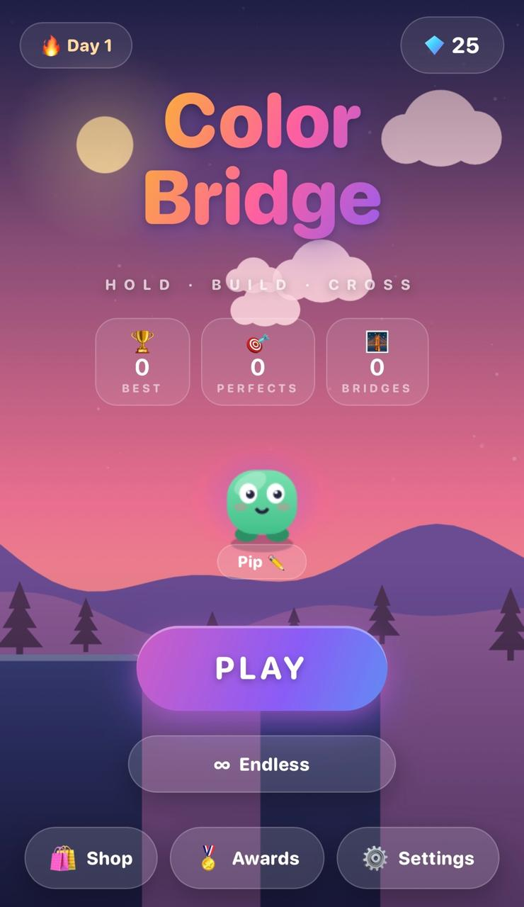
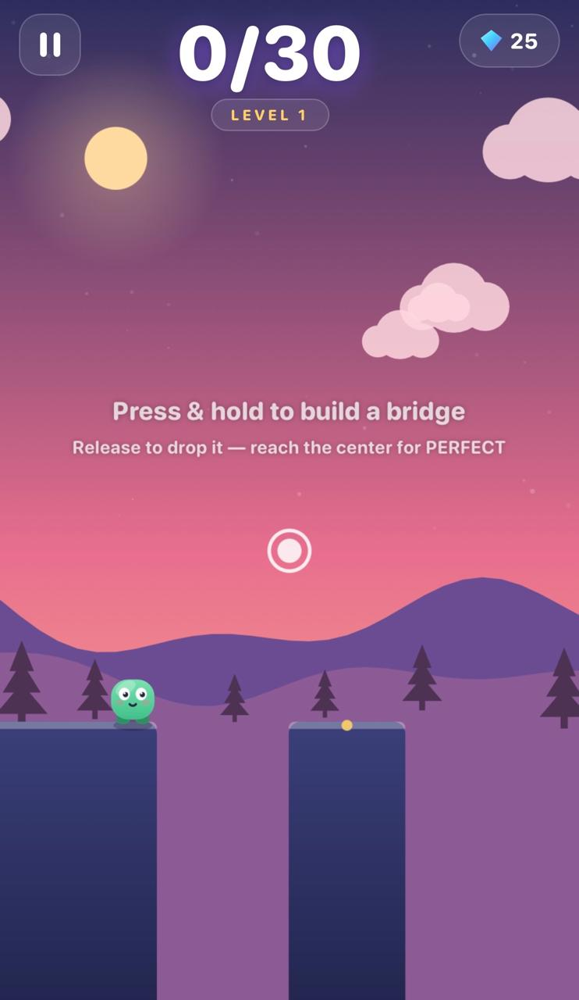
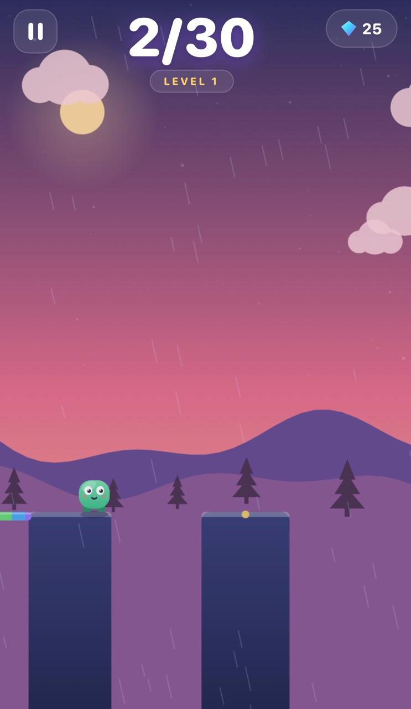
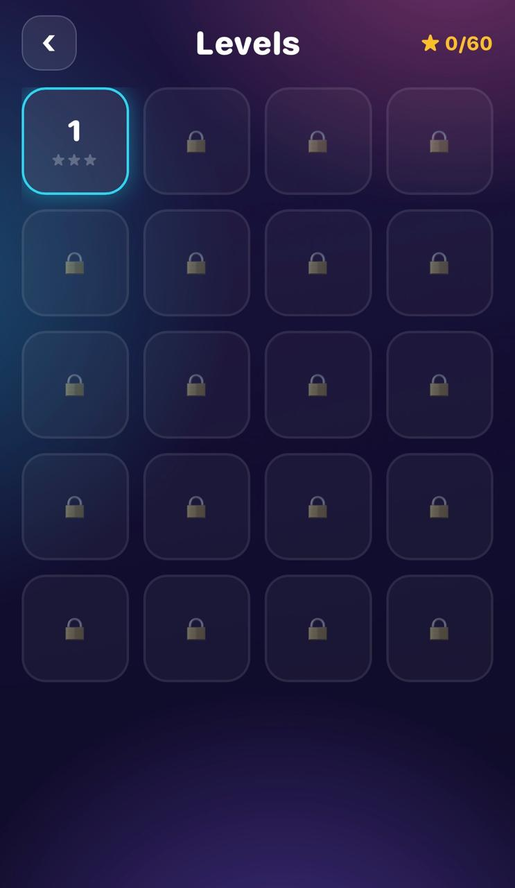
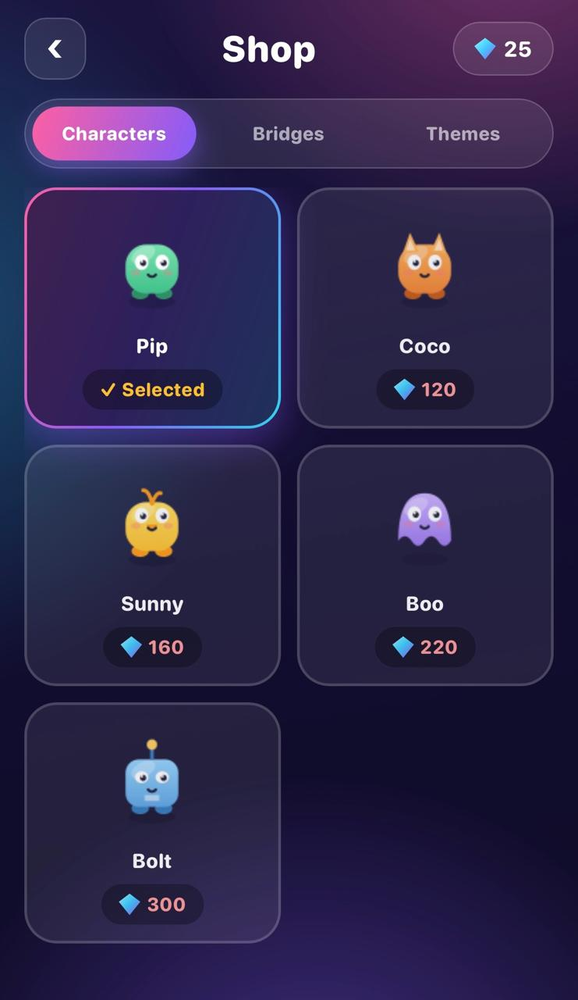
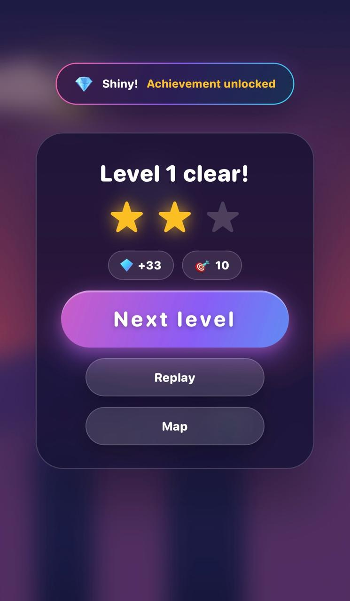

<div align="center">

#  🌈Color Bridge

### A relaxing, one-touch bridge-building game for the browser.

**Press & hold** to grow a colorful bridge → **release** to drop it onto the next tower → land in the center for a **PERFECT**. Easy to learn, hard to master.

*Every pixel, animation, sound, and note is generated in code the game ships **zero image or audio files** and contains only original work.*

<br>





<br><br>


[](https://tasnimasajid.github.io/ColorBridge/)
&nbsp;

&nbsp;

&nbsp;


**▶ Play it live:** [tasnimasajid.github.io/ColorBridge](https://tasnimasajid.github.io/ColorBridge/) — open on any phone or browser.

</div>

---

## About

Color Bridge is a minimalist arcade game built entirely with vanilla JavaScript and a single HTML5 `<canvas>` — no game engine, no frameworks, and no external assets. The whole experience, from the procedurally drawn characters and parallax backdrops to the synthesized music and sound effects, is generated at runtime in code.

The core loop is a single gesture: hold to extend a bridge, release to drop it. Time it right and you cross to the next tower; nail the center for a **PERFECT** and chain combos for bonus points. Behind that one-button simplicity sits a full progression system — levels, unlockable characters and themes, achievements, and daily rewards.

## Gameplay

| Step | What happens |
|---|---|
| **Start on the home screen** | Pick your character, check your best score and streak, then tap **PLAY**. |
| **Choose a level** | 20 levels on a star-rated map — or jump into endless **∞** mode. |
| **Hold to build** | A rainbow bridge grows while you press. The longer you hold, the further it reaches. |
| **Release to drop** | The bridge falls forward. Reach the next tower to cross; miss and your hero tumbles. |
| **Nail a PERFECT** | Land near a tower's center for bonus points, confetti, a gentle shake, and a combo chain. |
| **Collect & unlock** | Grab gems mid-run to unlock new characters, bridge styles, and background themes. |

<div align="center">



</div>

## Features

- 🎮 **One-touch gameplay** — a single press-and-hold; easy to learn, hard to master
- 🗺️ **20-level map** — 1–3 star ratings (stars come from perfect landings), lock/unlock progression, first-clear gem bonuses, and a different sky per level
- ♾️ **Endless mode** — every 8 bridges advances a stage with a banner and chime
- 🎯 **Perfect landings** — center hits award bonus points with combo multipliers, confetti, and a satisfying (gentle) screen shake
- 🏗️ **Moving towers** — from level 8 the target tower slides side-to-side until you land
- 🌄 **Living backdrops** — sunrise → day → sunset → night with smooth crossfades and parallax scenery (pine forests, desert cacti, a neon skyline)
- 🌧️ **Dynamic weather** — ambient rain drifts in and clears on its own, rainier at night
- 💎 **Unlockables** — spend gems on **5 characters**, **5 bridge styles**, and **4 theme packs**
- 🏅 **17 achievements**, 🎁 **daily rewards** with streaks, and a 🏆 **local high score**
- 🎨 **Full UI** — home, pause, game-over, and level screens, plus a shop and settings (music, SFX, vibration toggles)
- 🎵 **Generative audio** — an ambient music bed and all sound effects synthesized live with the Web Audio API (no audio files)
- 📱 **Responsive** — a DPR-aware canvas fits any screen from small phones to tablets, and auto-pauses when the app is backgrounded

## Controls

| Action | How |
| --- | --- |
| Grow the bridge | **Press and hold** anywhere (or hold **Space** on desktop) |
| Drop the bridge | **Release** |
| Pause | Tap the **❚❚** button (top-left) |

That's the whole game one button. 🙂

## Tech Overview

Color Bridge is a plain static web app (HTML + CSS + JavaScript) with no build step and no dependencies. Everything is drawn to a single `<canvas>`, and all art, animation, and sound is generated procedurally in code.

The codebase is organized as clean, modular vanilla JavaScript ( one concern per file ) :

| File | Responsibility |
| --- | --- |
| `index.html` | Markup for every screen + module load order |
| `css/style.css` | All UI styling — glassmorphism, gradients, dialogs, responsive layout |
| `js/utils.js` | Math / color helpers, seeded random, vibration |
| `js/config.js` | **Data**: tuning, difficulty & level curves, characters, bridges, themes, achievements |
| `js/storage.js` | **Save data**: gems, unlocks, stars, high score, daily rewards, achievement checks |
| `js/animations.js` | Easing curves, screen shake, floating score popups |
| `js/audio.js` | Synthesized SFX + generative ambient music (Web Audio) |
| `js/particles.js` | Confetti / dust / sparkle / splash particle system |
| `js/background.js` | Procedural sky, sun/moon, stars, clouds, parallax hills & scenery |
| `js/weather.js` | Ambient rain system (drifting showers) |
| `js/character.js` | Procedural character art — 5 unlockable heroes |
| `js/game.js` | **Gameplay**: state machine, platforms, bridge physics, levels, scoring |
| `js/ui.js` | **UI**: screens, HUD, shop, level map, achievements, settings, toasts |
| `js/main.js` | Bootstrap: canvas sizing, game loop, input routing |

**Performance notes**
- Single canvas, no DOM churn during play; UI screens are display-toggled overlays
- Device-pixel-ratio capped at 2× to keep fill-rate low on high-density phones
- Particle pool capped; pre-baked star/cloud fields; no per-frame allocations in hot paths
- `dt` clamped so background-tab hiccups can't break the physics

## Running Locally

It's a static site — no install, no build step.

Simply open `index.html` in a browser, or serve the folder for a production-like environment (so audio and everything behaves as intended):

```sh
npx http-server -p 8123 -c-1 .
# then open http://localhost:8123  (use your browser's phone/portrait emulation)
```

## License

Released under the [MIT License](LICENSE). All art, animation, and sound are original.

<div align="center">

Made with vanilla JavaScript and a single `<canvas>`. 💜

</div>
